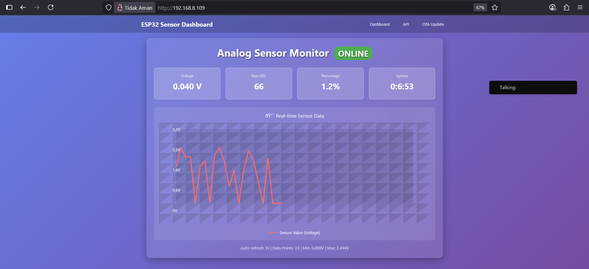
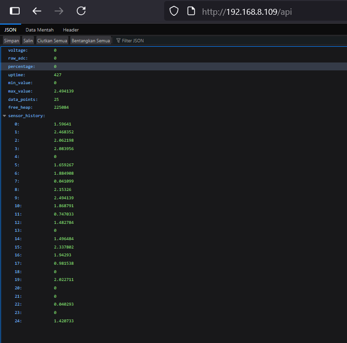
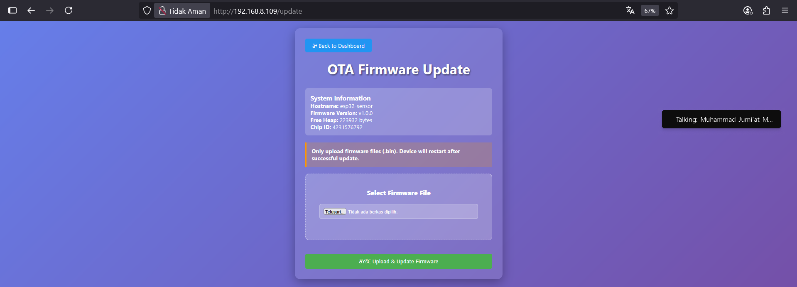

# Dashboard IoT Monitoring

Proyek ini merupakan tampilan antarmuka (dashboard) untuk memantau data IoT secara real-time. Dashboard ini mendukung monitoring API, update OTA, dan visualisasi data lainnya.

## Fitur
- Tampilan dashboard real-time
- Integrasi API untuk pengambilan data
- Dukungan Over-The-Air (OTA) update

## Cuplikan Layar

### Dashboard Utama

### API Monitoring

### OTA Update

